# AI Learning Brain 🧠

A personalized tutoring system that transforms technical PDF textbooks into an adaptive, graph-based learning experience. Upload a textbook chapter, and the system builds a knowledge graph, plans a learning path tailored to what you already know, teaches each concept, and quizzes you before moving forward.
Powered by **LangGraph**, **Groq LLM**, **Neo4j**, and **sentence-transformers**.

## 🚀 Overview

The AI Learning Brain is designed to solve the problem of information overload in technical subjects. It processes complex PDF documents, identifies core technical concepts, builds a hierarchical knowledge graph, and provides a multi-agent tutoring experience that adapts to the student's mastery level.

## 🏗 System Architecture

The project follows a modular, service-oriented architecture:

- **Frontend**: [Streamlit](https://streamlit.io/) provides a premium, responsive UI for both content processing and interactive learning.
- **Orchestration**: [LangGraph](https://langchain-ai.github.io/langgraph/) manages the agentic workflow using a robust **Command-based routing** pattern.
- **Brain (Knowledge Base)**: [Neo4j](https://neo4j.com/) stores the semantic relationships between concepts (Prerequisites, Subtopics, etc.).
- **Session Management**: [TinyDB](https://tinydb.readthedocs.io/) persists student progress, mastery scores, and historical learning paths.
- **LLM**: [Groq](https://groq.com/) (Llama-3.3-70B) powers the high-speed extraction and pedagogical reasoning.

## 🔄 End-to-End Workflow

### 1. Content Processing (The "Ingestion" Phase)
- **PDF Extraction**: Converts textbooks to clean Markdown using `PyMuPDF4LLM`.
- **Intelligent Chunking**: Splits text into technical segments while maintaining context.
- **Structural Extraction**: LLM analyzes each chunk to find technical concepts, difficulty scores, and LaTeX equations.
- **Validation**: Strict schema enforcement ensures zero data corruption before storage.

### 2. Brain Generation
- **Knowledge Ingestion**: The extracted JSON data is serialized and loaded into the Neo4j graph.
- **Relationship Building**: Automatically connects concepts based on prerequisites and shared units.

### 3. Learning Session (The "Tutor" Phase)
- **Intent Parsing**: Interprets student requests (e.g., "I want to learn about Op-Amps").
- **Path Planning**: Uses the **MSMS (Multi-Source Multi-Sink)** algorithm to find the mathematically optimal learning path based on the student's current mastery.
- **Diagnostic Assessment**: Generates targeted questions to evaluate the student's understanding.
- **Remediation**: If a student fails to answer correctly, the tutor provides a concise explanation addressing specific misconceptions and offers 3 attempts before adjusting the path.

## 📊 Visual Workflow



## 🛠 Setup & Installation

### Prerequisites
- Python 3.10+
- Neo4j Database (Local or AuraDB)
- Groq API Key

### Installation Steps
1. **Clone the repository**:
   ```bash
   git clone <repository-url>
   cd notebook-lm-mini
   ```

2. **Setup Virtual Environment**:
   ```bash
   python -m venv venv
   source venv/bin/activate  # On Windows: venv\Scripts\activate
   pip install -r requirements.txt
   ```

3. **Configure Environment**:
   Create a `.env` file in the root directory:
   ```env
   GROQ_API_KEY=your_groq_key
   NEO4J_URI=bolt://localhost:7687
   NEO4J_USERNAME=neo4j
   NEO4J_PASSWORD=your_password
   ```

4. **Run the Application**:
   ```bash
   streamlit run app.py
   ```

## 📂 Project Structure

- `app.py`: Main Streamlit application entry point.
- `src/services/`: Core logic (PDF, LLM, Graph, Tutor, Planner).
- `src/models/`: Pydantic and TypedDict schemas for data consistency.
- `src/database/`: Database connection and persistence layers.
- `data/`: Temporary storage for extracted concept JSONs.
- `sessions/`: Persistent storage for student session data.

---
*Built with ❤️ for Technical Education.*
